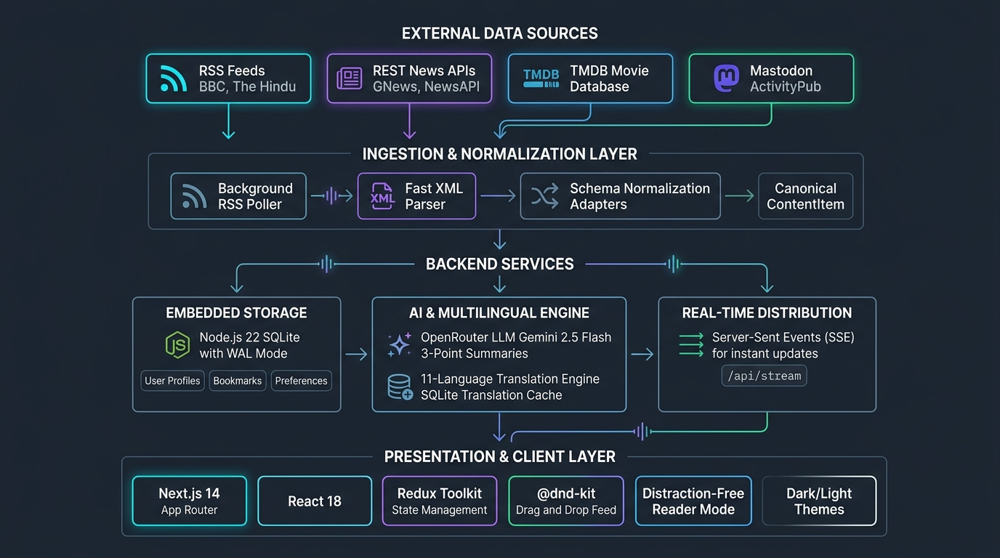

# Feed Pulse: Engineering Project Documentation

* **Candidate:** Hasini
* **GitHub Repository:** [https://github.com/hasini30/personalized-content-dashboard](https://github.com/hasini30/personalized-content-dashboard)
* **Live Hosted Application:** [https://personalized-content-dashboard-3zlf.onrender.com/](https://personalized-content-dashboard-3zlf.onrender.com/)
* **Demo Test Account:** `alex@example.com` / `password123` (or register a new account)

FeedPulse is an AI-powered personalized intelligence dashboard that aggregates, normalizes, and delivers real-time information across Global News, Trending Cinema, and Community Social Discussions in a single, distraction-free interface. Its feed adapts to each user through a relevance-scoring algorithm, drag-and-drop curation, followed publishers, reading history, and multi-tier preference persistence.

---

## 1. How Personalization Works

Personalization in FeedPulse is an end-to-end, multi-tier system spanning the database, backend ingestion, scoring algorithms, and client UI.

### A. Dynamic Relevance Scoring Algorithm (`rankPersonalizedItems`)

Rather than relying on naive binary filtering, FeedPulse calculates a composite relevance score for each article:

$$\text{Relevance Score} = \text{Category Bonus} + \text{Publisher Bonus} + \text{Live Bonus} - \text{Read Penalty}$$

| Signal | Points | Description |
| :--- | :---: | :--- |
| **Category match** | `+10` | The article matches any of the user's preferred topics. |
| **Followed publisher match** | `+15` | The article comes from an outlet the user follows (e.g., The Hindu, BBC, TechCrunch). |
| **Breaking / live news** | `+20` | Live coverage and breaking alerts are elevated. |
| **Reading history penalty** | `-5` | Once an article is read (tracked in `readItemIds`), it drops slightly so fresh stories surface first. |
| **Recency tie-breaker** | `n/a` | Articles with identical scores are sorted by `publishedAt` DESC. |

### B. Interactive Layout and Drag-and-Drop Curation (`@dnd-kit`)

* Users can manually rearrange feed cards using drag handles.
* State is managed in `feedSlice.ts` via `customOrder: string[]`.
* The `applyCustomOrder()` utility preserves the user's manual positioning while appending newly arrived live articles without disrupting the layout.
* Accessible via mouse, touch gestures, and keyboard (Space to grab, Arrow keys to move, Enter to drop).

### C. Smart "For You" Section Splitting (Filter-Bubble Prevention)

To prevent echo chambers, `UnifiedFeed.tsx` partitions the feed into two sections:
1. **Curated For You:** highlighted cards matching the user's top preferences.
2. **Discover More / Other Topics:** remaining top global headlines and cinema, so the user always has a path to new topics.

### D. Multi-Tier Preference Persistence

* **Redux Store:** immediate, reactive in-memory state across the React component hierarchy.
* **Offline Local Storage (`redux-persist`):** preserves preferences across browser reloads, even before sign-in.
* **Native SQLite Database:** a persistent preferences table keyed by `user_id` (`preferencesRepository.ts`), synchronized via `/api/user/preferences`.

---

## 2. Executive Summary and Problem Statement

### The Problem
Modern web users face information fragmentation and tab fatigue. Keeping up with daily events means switching between sites for international news, entertainment databases for movie releases, and social platforms for community commentary. News sites are also plagued by intrusive ads, trackers, and paywalls, and non-English speakers face significant language barriers when accessing global journalism.

### The Solution: FeedPulse
FeedPulse consolidates Global News, Trending Cinema, and Community Social Discussions into one accessible stream, personalized to each user and free of third-party tracking.

---

## 3. Core Capabilities and User Experience

* **Unified Multi-Source Feed:** Merges RSS feeds (BBC, The Hindu, Reuters, TechCrunch, The Guardian), REST APIs (GNews, NewsAPI), TMDB cinema releases, and Mastodon social feeds into a single stream.
* **Distraction-Free Reader Mode:** Extracts and renders clean article text while stripping ads, trackers, and cookie notices.
* **AI Article Summaries:** On-demand 3-point executive summaries via OpenRouter LLMs, with grounding verification against the source text.
* **11-Language Multilingual Engine:** Full UI localization and instant article translation across English and 10 Indian regional languages (Hindi, Bengali, Telugu, Tamil, Marathi, Gujarati, Kannada, Malayalam, Punjabi, Urdu).
* **Live Updates (SSE):** Streams incoming articles and breaking news via Server-Sent Events without full-page reloads.
* **Bookmarks:** Per-user bookmarks stored in SQLite.
* **Zero-Config Resiliency:** Works even if third-party API keys are missing or rate-limited, by falling back to built-in curated datasets.

---

## 4. Architecture and Technical Design Decisions

*Figure 1: FeedPulse system architecture*

### Architecture Breakdown

#### 1. External Data Sources Layer
* **RSS Feeds:** Real-time syndication from BBC News, The Hindu, Reuters, TechCrunch, and The Guardian.
* **REST News APIs:** On-demand topic ingestion from GNews and NewsAPI.
* **Cinema Database:** TMDB API for live movies, genres, release metadata, and poster art.
* **Decentralized Social:** Mastodon ActivityPub instances for live community conversations.

#### 2. Ingestion and Normalization Layer
* **Background RSS Poller:** Queries feeds every 30 seconds.
* **Fast XML Parser:** Strips HTML entities, extracts thumbnails, and parses XML payloads.
* **Schema Adapters:** Convert heterogeneous responses into a canonical `ContentItem` schema.

#### 3. Backend Services and Persistence
* **Embedded Storage:** Node.js 22 native SQLite (`node:sqlite`) in WAL mode, storing users, preferences, bookmarks, and RSS articles.
* **AI and Multilingual Engine:** OpenRouter LLM (`google/gemini-2.5-flash`) generating grounded 3-point summaries and 11-language translations, with persistent SQLite caching.
* **Real-Time Distribution:** Server-Sent Events (SSE) at `/api/stream` push live updates directly to connected browsers.

#### 4. Presentation and Client Layer
* **Next.js 14 App Router and React 18:** Server and client components with zero layout shift.
* **Redux Toolkit:** Centralized state management with RTK Query remote data caching.
* **`@dnd-kit`:** Interactive drag-and-drop feed curation.
* **Distraction-Free Reader Mode:** Clean reading modal with responsive Dark/Light themes.

### Key Engineering Decisions
1. **Adapter Pattern for Data Normalization:** Disparate external schemas (RSS XML, TMDB movie objects, Mastodon toots) are normalized into a unified `ContentItem` interface. This decouples the presentation layer from third-party API changes.
2. **Native Node.js 22 SQLite (`node:sqlite`):** Uses Node 22's built-in SQLite engine in WAL (Write-Ahead Logging) mode. This avoids heavy external database servers, eliminates native compilation issues (e.g., `node-gyp`), and delivers microsecond query latencies.
3. **State Separation (Server vs. Client State):** RTK Query manages remote data fetching, deduping, and caching. Standard Redux Toolkit slices manage local client state (drag-and-drop order, active filters, reading history).
4. **Server-Side API Proxying:** The browser never calls external APIs directly. Next.js route handlers keep API keys secure, handle rate limiting (60 req/min), and prevent CORS errors.

---

## 5. Technology Stack

| Layer | Technologies |
| :--- | :--- |
| **Frontend** | Next.js 14 (App Router), React 18, TypeScript (strict mode) |
| **State Management** | Redux Toolkit, RTK Query, `redux-persist` |
| **Styling and UI** | Tailwind CSS, Framer Motion, `@dnd-kit`, Lucide React, `next-themes` |
| **Database** | Node.js 22 native SQLite (`node:sqlite`), WAL mode |
| **Authentication** | NextAuth.js v4 (Credentials Provider, JWT sessions, PBKDF2-SHA512) |
| **AI and Translation** | OpenRouter API (`google/gemini-2.5-flash`), custom multilingual engine |
| **Testing and QA** | Jest, React Testing Library, MSW, Playwright, `axe-core` |
| **Deployment** | Render (Web Service + 1 GB persistent disk), Docker (multi-stage Alpine) |

---

## 6. Security and Quality Engineering

* **SSRF Guard:** The article extraction reader validates URLs, blocking private IP ranges (RFC 1918), loopback interfaces, and non-HTTP schemes.
* **Cryptographic Passwords:** Passwords are hashed with PBKDF2-SHA512 using cryptographically random salts and verified in constant time.
* **HTTP Security Headers:** Configured in `next.config.mjs` with HSTS, `X-Frame-Options: DENY`, `X-Content-Type-Options: nosniff`, and restrictive referrer policies.
* **Accessibility (WCAG 2.1 AA):** Skip-to-content links, visible keyboard focus rings, reduced-motion media query support, and automated `axe-core` scans.

---

## 7. Testing, CI and Code Verification

* **Unit and Integration Tests:** 64 test suites passing (343 tests, 0 failures) using Jest and React Testing Library.
* **Type Safety:** Strict TypeScript compliance with zero errors (`tsc --noEmit`).
* **Linting:** ESLint passing with zero warnings.
* **Continuous Integration:** A GitHub Actions pipeline (`.github/workflows/ci.yml`) validates lint, type check, unit tests, and production build on every push (passing green).

---

## 8. Deployment Architecture

* **Live Deployment:** Hosted on Render as a Web Service.
* **Persistent Disk:** A 1 GB disk mounted at `/var/data`, configured in `render.yaml`, keeps the SQLite database across restarts.
* **Docker Support:** A production-ready, multi-stage Dockerfile (`node:22-alpine`) runs as a non-privileged user (`nextjs:nodejs`).
* **Serverless Compatibility:** Detects read-only serverless environments (e.g., Vercel) and routes database writes to `/tmp/feedpulse.sqlite`.

---

## 9. Evaluation and Test Credentials

The hosted application is live and pre-seeded with test accounts:

* **Live App URL:** [https://personalized-content-dashboard-3zlf.onrender.com/](https://personalized-content-dashboard-3zlf.onrender.com/)

| Role | Email | Password |
| :--- | :--- | :--- |
| **Tech Curator** | `alex@example.com` | `password123` |
| **Finance Analyst** | `priya@example.com` | `password123` |
| **Guest Explorer** | `guest@feedpulse.local` | `guestpass` |
